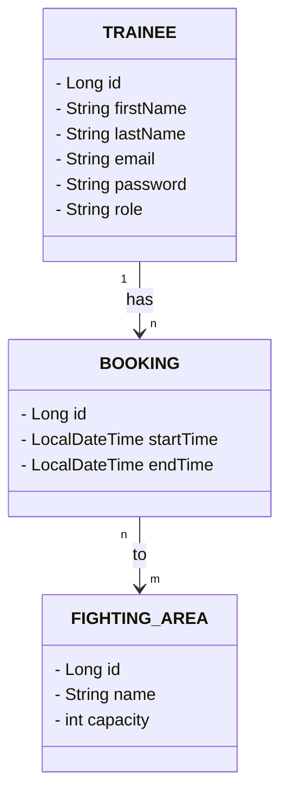

# MY FINAL JAVA PROJECT
**Title:** Box Studio Booking System  
**Entities:** Trainees, Fighting Area, Booking, Slot 

The "Boxing Studio Booking System" is an application designed to efficiently manage training schedules in a boxing gym while optimizing facility utilization. 

The "Trainee" manages all relevant member data, including their contact details. The "Fighting Area" represents physical training zones, such as boxing rings, training zones along with their capacities. 

Trainees book the training area using the system. 
The booking can always be made as long as there is remaiing capacity in the selected fighting area. 

---

---

## Requirements

### Trainee Actions
- A trainee can register themselves.
- A trainee can login and receive an access token.
- A trainee can see all registered trainees.
- A trainee can delete his/her account.
- A trainee can create a booking for multiple fighting areas.
- A trainee can only book a fighting area if it is not already booked at that time.
- A trainee can see all bookings and his/her personal bookings.
- A trainee can update an existing booking.
- A trainee can delete his/her booking only if it is +24 hours before the appointment.

### Manager Actions
- A manager can add a fighting area with a name and capacity.
- A manager can delete a fighting area.

 

---
Presentation Link: https://docs.google.com/presentation/d/1mRjSQTPHxt3fGO0CcGLnhZnWMZVlHSld6ICUPnEd5P0/edit?usp=sharing

GitHub Link: https://github.com/T-uba/IronHackFinalProject.git

---

 

## Class Diagram (ERD)

 
 

## API First Design

### 1. Trainee API

#### POST /api/register
Create new Trainee

| POST /api/register | | |
| :--- | :--- | :--- |
| **AUTHORIZATION:** | None | |
| **Data IN:** | **Data out (Success):** | **Data out (Error):** |
| { &nbsp;&nbsp;"firstName", &nbsp;&nbsp;"lastName", &nbsp;&nbsp;"email", &nbsp;&nbsp;"password" } | **201 Created** "Trainee registered successfully." | **400 Bad Request** "Email is already taken."  **400 Bad Request** "The provided name is too short." |

 

#### POST /api/register/manager
Create new Manager

| POST /api/register/manager | | |
| :--- | :--- | :--- |
| **AUTHORIZATION:** | None | |
| **Data IN:** | **Data out (Success):** | **Data out (Error):** |
| { &nbsp;&nbsp;"firstName", &nbsp;&nbsp;"lastName", &nbsp;&nbsp;"email", &nbsp;&nbsp;"password" } | **201 Created** "Manager registered successfully." | **400 Bad Request** "Email is already taken."  **400 Bad Request** "The provided name is too short." |

 

#### GET /api/trainees
Get all Trainees (Managers Only)

| GET /api/trainees | | |
| :--- | :--- | :--- |
| **AUTHORIZATION:** | Bearer Token (ROLE_MANAGER) | |
| **Data IN:** | **Data out (Success):** | **Data out (Error):** |
| None | **200 OK** [ &nbsp;&nbsp;{ "firstName", "lastName", "email" }, ... ] | **403 Forbidden** "Access denied. Managers only." |

 

#### DELETE /api/trainees/delete/{id}
Delete a Trainee Account

| DELETE /api/trainees/delete/{id} | | |
| :--- | :--- | :--- |
| **AUTHORIZATION:** | Bearer Token | |
| **Data IN:** | **Data out (Success):** | **Data out (Error):** |
| PathVariable: id | **200 OK** "Account deleted successfully." | **400 Bad Request** "Trainee account does not exist." |

---
 

### 2. Login API

#### POST /api/login
Authenticate User and get Access Token

| POST /api/login | | |
| :--- | :--- | :--- |
| **AUTHORIZATION:** | Basic Auth (Email & Password in Header) | |
| **Data IN:** | **Data out (Success):** | **Data out (Error):** |
| None | **200 OK** { &nbsp;&nbsp;"access_token": "JWT_TOKEN_STRING" } | **401 Unauthorized** Bad credentials |

---
 

### 3. Booking API

#### GET /api/bookings
Get Studio Bookings (Managers see all, Trainees see only their own)

| GET /api/bookings | | |
| :--- | :--- | :--- |
| **AUTHORIZATION:** | Bearer Token | |
| **Data IN:** | **Data out (Success):** | **Data out (Error):** |
| None | **200 OK** [ &nbsp;&nbsp;{ "id", "trainee", "fightingAreas": [], "startTime", "endTime" }, ... ] | **403 Forbidden** Access Token missing or invalid |

 

#### GET /api/bookings/trainee/{traineeId}
Get Bookings for a Specific Trainee by ID

| GET /api/bookings/trainee/{traineeId} | | |
| :--- | :--- | :--- |
| **AUTHORIZATION:** | Bearer Token | |
| **Data IN:** | **Data out (Success):** | **Data out (Error):** |
| PathVariable: traineeId | **200 OK** [ &nbsp;&nbsp;{ "id", "trainee", "fightingAreas": [], "startTime", "endTime" }, ... ] | **403 Forbidden** Access Token invalid |

 

#### POST /api/bookings
Create a New Booking

| POST /api/bookings | | |
| :--- | :--- | :--- |
| **AUTHORIZATION:** | Bearer Token | |
| **Data IN:** | **Data out (Success):** | **Data out (Error):** |
| { &nbsp;&nbsp;"traineeId", &nbsp;&nbsp;"fightingAreaIds": [], &nbsp;&nbsp;"startTime", &nbsp;&nbsp;"endTime" } | **201 Created** "Booking created successfully." | **400 Bad Request** "Trainee does not exist."  **400 Bad Request** "Fighting area does not exist."  **400 Bad Request** "This area has reached its maximum capacity." |

 

#### PUT /api/bookings
Update an Existing Booking

| PUT /api/bookings | | |
| :--- | :--- | :--- |
| **AUTHORIZATION:** | Bearer Token | |
| **Data IN:** | **Data out (Success):** | **Data out (Error):** |
| { &nbsp;&nbsp;"id", &nbsp;&nbsp;"traineeId", &nbsp;&nbsp;"fightingAreaIds": [], &nbsp;&nbsp;"startTime", &nbsp;&nbsp;"endTime" } | **200 OK** "Booking updated successfully." | **400 Bad Request** "Booking does not exist."  **400 Bad Request** "Fighting area does not exist."  **400 Bad Request** "This area has reached its maximum capacity." |

 

#### DELETE /api/bookings/delete/{id}
Delete a Booking (Allowed up to 24h before)

| DELETE /api/bookings/delete/{id} | | |
| :--- | :--- | :--- |
| **AUTHORIZATION:** | Bearer Token | |
| **Data IN:** | **Data out (Success):** | **Data out (Error):** |
| PathVariable: id | **200 OK** "Booking deleted successfully." | **400 Bad Request** "Booking does not exist."  **400 Bad Request** "Cannot delete booking less than 24 hours before." |

---
 

### 4. Fighting Area API

#### POST /api/areas
Create a New Fighting Area (Managers Only)

| POST /api/areas | | |
| :--- | :--- | :--- |
| **AUTHORIZATION:** | Bearer Token (ROLE_MANAGER) | |
| **Data IN:** | **Data out (Success):** | **Data out (Error):** |
| { &nbsp;&nbsp;"name", &nbsp;&nbsp;"capacity" } | **201 Created** "Fighting area created successfully." | **400 Bad Request** "Invalid area name."  **403 Forbidden** Access denied |

 

#### GET /api/areas
Get All Fighting Areas

| GET /api/areas | | |
| :--- | :--- | :--- |
| **AUTHORIZATION:** | Bearer Token | |
| **Data IN:** | **Data out (Success):** | **Data out (Error):** |
| None | **200 OK** [ &nbsp;&nbsp;{ "id", "name", "capacity" }, ... ] | **403 Forbidden** Access Token invalid |

 

#### DELETE /api/areas/delete/{id}
Delete a Fighting Area (Managers Only)

| DELETE /api/areas/delete/{id} | | |
| :--- | :--- | :--- |
| **AUTHORIZATION:** | Bearer Token (ROLE_MANAGER) | |
| **Data IN:** | **Data out (Success):** | **Data out (Error):** |
| PathVariable: id | **200 OK** "Fighting area successfully deleted." | **403 Forbidden** Access denied |

---

